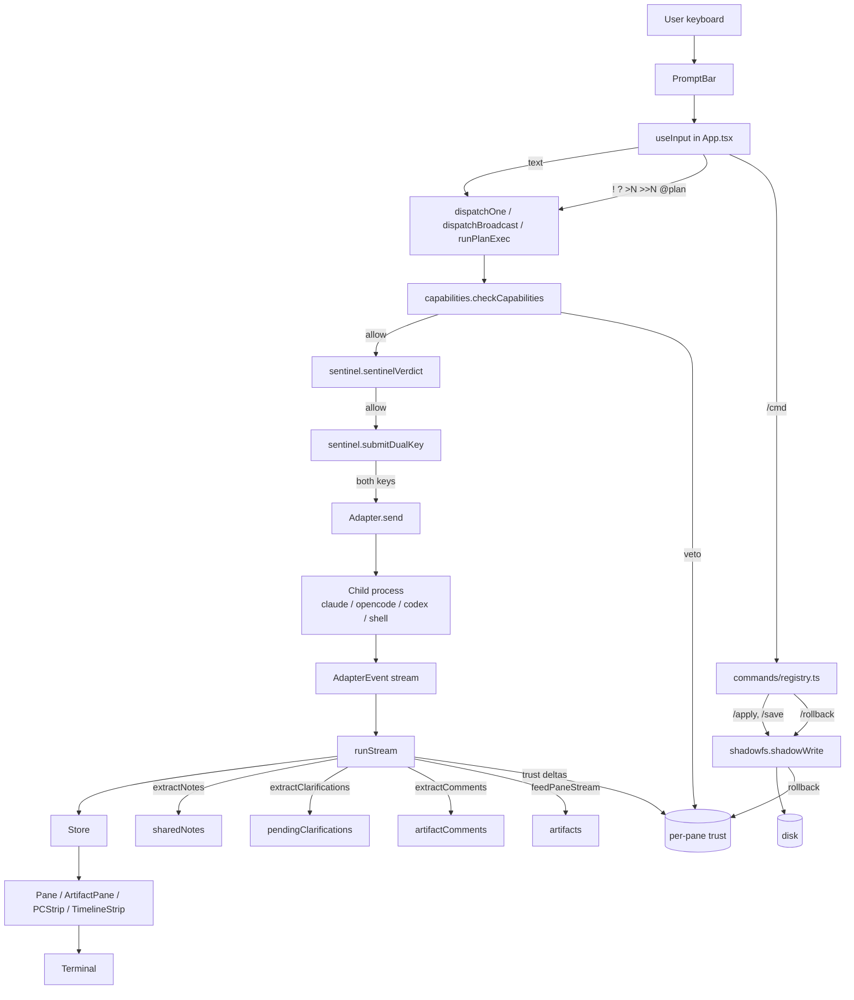

# Architecture

For the design rationale see [PATTERNS.md](../PATTERNS.md). For the safety pipeline see [CONTROL.md](../CONTROL.md).

## Module map



## Dispatch pipeline (the single hot path)

Every action that touches the OS goes through this:

```
                ┌─────────────────────┐
   user prompt  │  capability check   │  no → "permission denied"
   ──────────► │  (read/write/exec)   │
                └──────────┬──────────┘
                           │ ok
                           ▼
                ┌─────────────────────┐
                │  sentinel verdict   │  veto → trust -= 0.10
                │  (deterministic)    │  (no execution)
                └──────────┬──────────┘
                           │ ok / requiresDualKey
                           ▼
                ┌─────────────────────┐
                │  dual-key handoff   │  pending → notify user
                │  (60s window)       │  (no execution)
                └──────────┬──────────┘
                           │ acknowledged
                           ▼
                ┌─────────────────────┐
                │  shadow journal     │  records previous/next bytes
                │  (shadowWrite)      │  for rollback
                └──────────┬──────────┘
                           │
                           ▼
                ┌─────────────────────┐
                │  execute            │  spawn / writeFile
                │  (Adapter.send)     │
                └──────────┬──────────┘
                           │
                  done → trust += 0.05
                  fault → trust -= 0.05
                  rollback → trust -= 0.15
```

## Layer diagram

```
┌─────────────────────────────────────────────────────────────────┐
│                       Render layer                              │
│   StatusBar  Pane×N  ArtifactPane  PCStrip  TimelineStrip       │
│   RaceBars  LangGraphTicker  PromptBar  Notifications  Help     │
└──────────────────────────┬──────────────────────────────────────┘
                           │ useSyncExternalStore + shallow memo
┌──────────────────────────▼──────────────────────────────────────┐
│                       Store (src/store.ts)                      │
│   panes  targetSlots  artifacts  sharedNotes  langgraph         │
│   capabilities  trust  broadcast  pendingClarifications         │
└──────────────────────────┬──────────────────────────────────────┘
                           │ actions
┌──────────────────────────▼──────────────────────────────────────┐
│                     Orchestration (App.tsx)                     │
│   dispatchOne  dispatchBroadcast  runPlanExec  runStream        │
└─────┬─────────────────────┬────────────────────┬────────────────┘
      │                     │                    │
      ▼                     ▼                    ▼
┌───────────┐       ┌───────────────┐    ┌─────────────────┐
│ Adapters  │       │ Governance    │    │ Substrate       │
│ claude    │       │ capabilities  │    │ artifacts       │
│ opencode  │       │ sentinel      │    │ autoNotes       │
│ codex     │       │ shadowfs      │    │ clarify         │
│ shell     │       │ replay        │    │ confidence      │
│ langgraph │       │ selfMod (mcp) │    │ commentOn       │
│ iterm     │       │ triggers      │    │ langsmith       │
└───────────┘       └───────────────┘    └─────────────────┘
```

## Where to start reading

If you're contributing for the first time and want to understand the codebase:

1. `src/store.ts` — what state exists
2. `src/lib/grammar.ts` — what operators exist
3. `src/App.tsx::useInput` — how operators become actions
4. `src/App.tsx::dispatchOne` — what an action does
5. Pick one adapter (`src/adapters/claude.ts` is simplest), one safety lib (`src/lib/sentinel.ts`), one render component (`src/components/Pane.tsx`)

That's ~600 lines of reading and you can land your first PR.
